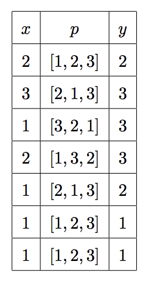

270. Алиса, Боб и шифрование

Алиса и Боб всё ещё работают в отделе безопасности передачи данных и занимаются любимым делом — исследуют только что придуманный алгоритм шифрования на криптостойкость.

Алгоритм, придуманный Алисой и Бобом, весьма прост. Во время шифрования алгоритм принимает символы шифруемого текста по одному и заменяет этот символ на ровно один другой символ. Кодировка, которой пользуются Алиса и Боб, состоит из mm символов, поэтому можно считать, что текст преставляет собой последовательность натуральных чисел, не превосходящих mm. Во время работы алгоритм шифрования поддерживает перестановку натуральных чисел от 1 до m. В начале работы перестановка тождественна, то есть pi​=i для всех i. Когда алгоритму на вход поступает символ x, алгоритм заменяет его на номер позиции в перестановке (в 1-индексации), на которой находится символ x, а также переносит x в начало перестановки. Например, если в некоторый момент работы алгоритма перестановка символов в нём равна [4,2,1,3], а на вход подаётся символ 1, то символ 1 будет заменён на символ 3, поскольку 1 стоит в перестановке на третьей позиции, а перестановка примет вид [1,4,2,3]. Несложно заметить, что результатом шифрования текста, состоящего из nn натуральных чисел, не превосходящих m, также является текст, состоящий из n натуральных чисел, не превосходящих m.

Для упрощения исследования Алиса и Боб решили реализовать эффективное кодирование и декодирование текстов при помощи своего алгоритма, однако Чак, Крейг и Ева нарушили их планы, поэтому Алиса и Боб просят вас реализовать их алгоритм кодирования.

Формат ввода

В первой строке заданы три целых числа n, m и type (1≤n,m≤300 000,type∈{1,2}) — длина текста, количество символов в кодировке и режим работы программы соответственно.

Если type=1, то требуется зашифровать заданный текст.

Если type=2, то требуется расшифровать заданный зашифрованный текст.

В следующей строке задано nn целых чисел (1≤ai​≤m) — текст для обработки.

Формат вывода

Выведите n целых чисел — результат обработки текста. Можно показать, что результат расшифровки текста всегда существует и единственен.

Примечание

В первом примере требуется зашифровать заданный текст. Проиллюстрировать работу алгоритма удобно при помощи таблицы. Обозначим за xx — символ текста, pp — перестановку символов кодировки до шифрования xx, yy — зашифрованный символ.

Во втором примере требуется расшифровать текст, зашифрованный в первом пункте, поэтому результат расшифровки совпадёт с исходным текстом.

[Решение](solution.cpp)