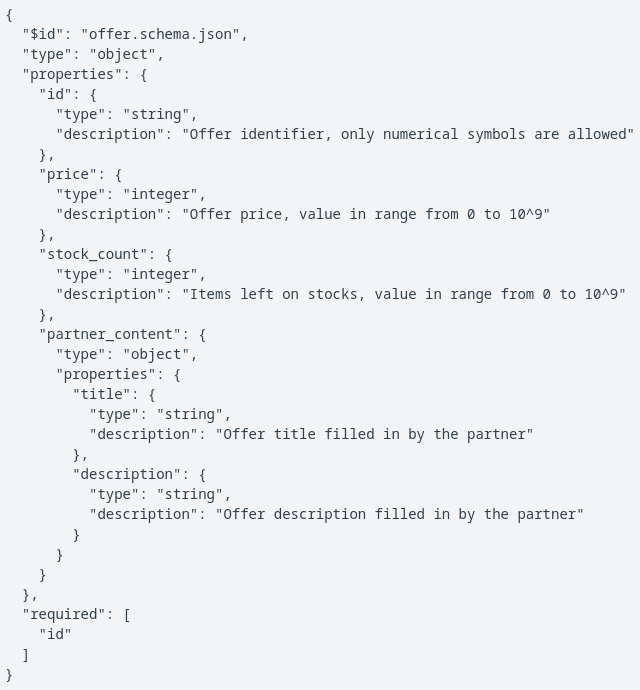
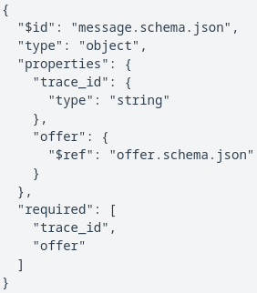

239. Сервис подписки

В Яндекс Маркете разрабатывают новый сервис для хранения информации про товарные предложения. В MVP планируется поддержать две основные механики: обработка запросов на частичное обновление товарных предложений в базе и отправка обновленных данных сервисам-подписчикам.

Товарное предложение в базе описывается следующей JSON схемой:

При межсервисном взаимодействии к товарному предложению добавляется контекст, который содержит идентификатор для сквозной трассировки, его схема:

Сервис, который отправляет запрос на обновление товарного предложения, обязательно заполняет идентификатор оффера (поле offer.idoffer.id) и идентификатор для трассировки (поле trace_idtrace_id). Все остальные поля в запросе опциональны. В таком случае при применении обновления будет происходить слияние полей. Например, в базе у оффера заполнены поля price=9990price=9990, и приходит обновление stock_count=100stock_count=100, тогда в базе будут сохранены оба поля price=9990;stock_count=100price=9990;stock_count=100. Гарантируется, что все входящие запросы валидны и соответствуют схеме. Так как это прототип, удаление товаров из базы и очищение полей было решено не поддерживать.

Помимо хранения товарных предложений в базе, в сервисе необходима функция доставки обновлений в сервисы-подписчиков. Одна подписка включает в себя два набора полей: trigger и shipment, не обязательно листовых. Когда изменяется любое trigger поле или поле, вложенное в trigger поле, подписчику отправляется сообщение. В сообщении находятся все shipment и trigger поля этого подписчика, а также идентификаторы оффера и трассировки из запроса, который привел к этому сообщению. Инициализация поля также считается за его изменении и создает сообщение об обновлении.

Формат ввода

Первая строка входных данных содержит два целых числа nn и mm (1≤n≤50,1≤m≤10,0001≤n≤50,1≤m≤10,000) — количество сервисов подписчиков и количество запросов на обновления.

Следующие nn строк содержат описания сервисов подписчиков: ii-я строка содержит описание ii-го подписчика. В начале строки задается aiai​ и bibi​ — количество trigger и shipment полей соответственно. Далее aiai​ trigger полей, и bibi​ shipment полей.

Следующие mm строк содержат запросы на обновление, каждая строка — это валидный json, удовлетворяющий схеме message.schema.jsonmessage.schema.json.
Формат вывода

На каждое событие обновления выведите kjkj​ сообщений в формате message.schema.jsonmessage.schema.json, где kjkj​ — это количество сервисов-подписчиков, которым данное событие интересно. Сообщения должны идти в том же порядке, что и обновления, которые привели к ним. Сообщения в рамках одного обновления должны быть отсортированы по порядковому номеру подписчика.
Примечание

Для решений на языке Python доступны библиотеки json, requests и urllib.

Для решений на языке Java доступны библиотеки jackson-core:2.13.1, jackson-annotations:2.13.1 и jackson-databind:2.13.1 . Соответствующие функции импорта могут иметь вид:

[Решение](solution.py)